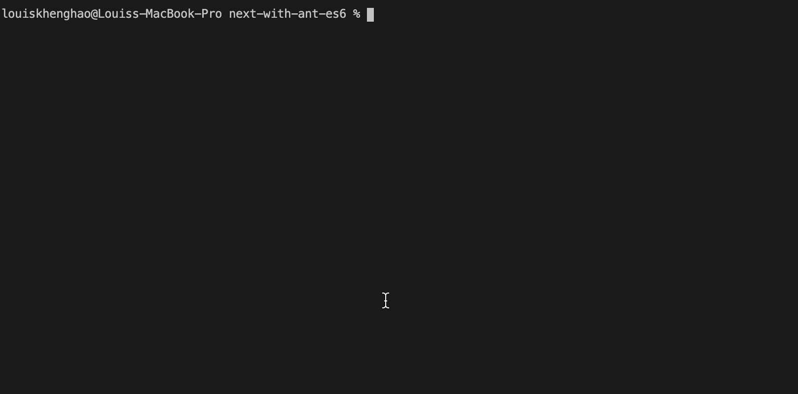

This project skeleton is created by [LavaX Technologies Sdn Bhd](https://lavax.co) that is great for project planning on transition from ES6 to TypeScript.

NextJs with combination of technologies that enable developers to getting started with ease.

# Used of Technologies

1.  Coding styles - `TypeScript` & `ES6` are enabled
2.  UI styles - `styled-jsx` & `styled-components`, works on both SSR & SSG
3.  UI Framework - `AntDesign`
4.  Coding Practice - `Eslint` rules for `(.ts, .tsx, .js, .jsx)`
5.  API Integration - `GraphQL (with codegen)`

# Getting Started

**Note: To install @lava-x private packages, we first need to setup project level .npmrc file. **

1. Create .npmrc file in project root level
2. Paste below code into the .npmrc & save
```
//registry.npmjs.org/:_authToken=${REQUEST_TOKEN_FROM_LAVAX_TEAM}
```
3. Install packages 
```bash
yarn
# or
yarn install
```

Available commands:

```bash
yarn build # to build

yarn start # to start production server

yarn dev # to start development server

yarn clean # to remove .next folder

yarn eslint # to run eslint rules check

yarn eslint-fix # to run eslint rules & soft fix

yarn gql-generate # to generate graphql Types, hooks, Documents based on input operations
```

Open [http://localhost:3100](http://localhost:3100) with your browser to see the result.

You can start editing the page by modifying `pages/index.js`. The page auto-updates as you edit the file.

---

## GraphQL CodeGen

First step is change the schema url to your development server at `.codegen.yml`

```yml
schema: "http://localhost:3000/graphql"
```

Second step find the operations file at `src/graphql/operations/index.graphql` and modify it, for example

```GraphQL
fragment MerchantInfo on Merchant {
  id
  email
  firstName
  lastName
  phoneCode
  phoneNumber
  referralCode
  role
  generalStatus
  hasBusiness
  createdAt
  updatedAt
  identities {
    id
    createdAt
    updatedAt
    provider
    providerId
  }
}

query getMerchantAuthProfile {
  getMerchantAuthProfile {
    ...MerchantInfo
  }
}
```

Third Step is to generate the GraphQL Types, Documents, Hooks by running the command `yarn gql:generate`


Fourth Step is to import any of Types, Documents, Hooks to your components or the places you wants to use it

```js
// example from src/config/getAuthProfile.ts
import get from "lodash/get";
import { GetMerchantAuthProfileDocument } from "app-graphql";
import { ApolloClient, NormalizedCacheObject } from "@apollo/client";

export default (
  apolloClient: ApolloClient<NormalizedCacheObject>
): Promise<{ authUser: any }> => {
  return apolloClient
    .query({
      query: GetMerchantAuthProfileDocument
    })
    .then(({ data }) => {
      const authUser = get(data, "getMerchantAuthProfile", null);
      return { authUser };
    })
    .catch(() => {
      // Fail gracefully
      return { authUser: null };
    });
};
```

# E2E Testing

## Best Practices

1. Use route aliases or assertions to guard Cypress from proceeding until an explicit condition is met.
2. Use data-* attributes to provide context to your selectors and isolate them from CSS or JS changes.
3. Only test what you control. Try to avoid requiring a 3rd party server. When necessary, always use cy.request() to talk to 3rd party servers via their APIs
4. Tests should always be able to be run independently from one another and still pass.
5. Add multiple assertions and don’t worry about it.
6. Clean up state before tests run.

https://docs.cypress.io/guides/references/best-practices.html

Check out Cypress Real World App as standard
https://github.com/cypress-io/cypress-realworld-app

## Storybook

### Get Started

run `yarn storybook`.

### Issues

Storybook does not work with `styled-jsx-plugin-less`. Use `styled-jsx-plugin-sass` for now.
https://github.com/vercel/next.js/issues/19058

# About US

Check out our company profile [LavaX Technologies Sdn Bhd](https://lavax.co), and welcome to reach out for inquires.
